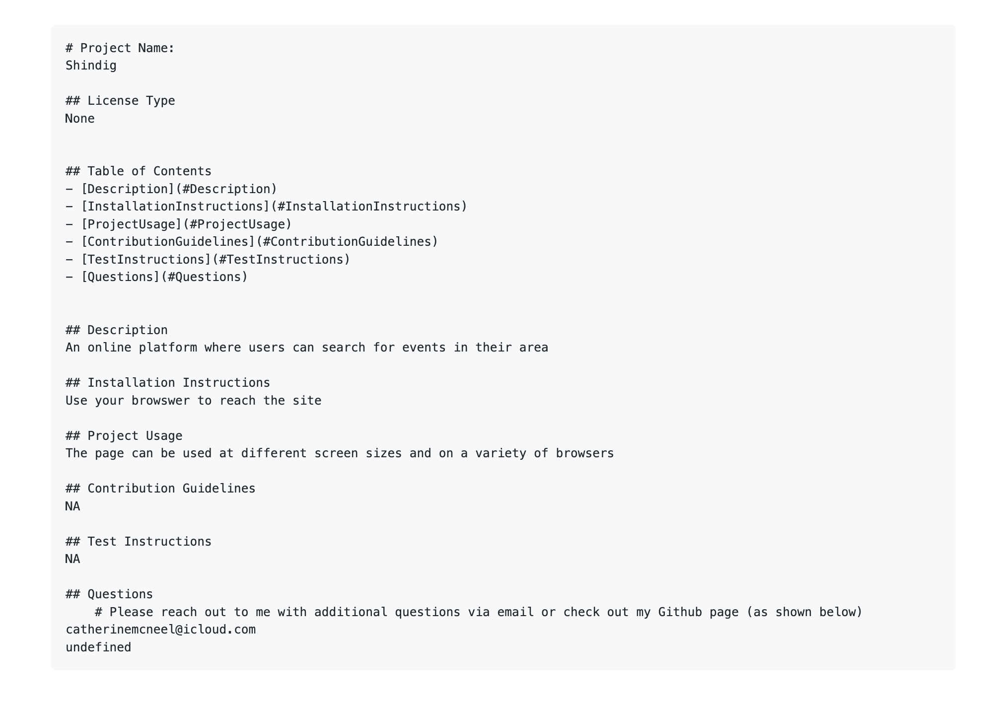

# Professional README Generator Starter Code

[How to create a Professional README](https://coding-boot-camp.github.io/full-stack/github/professional-readme-guide)

## This application is a command line application that allows a user to build a professional Read Me file

### The user provides project information by answering a series of questions prompted in the terminal
 
### This information is taken and stored in a professionally formatted Read Me file
### The User can access this file and use it to demonstrate their project

### SEE BELOW: An example of a Read ME a user can create

This site was built using [GitHub Pages](https://pages.github.com/).

